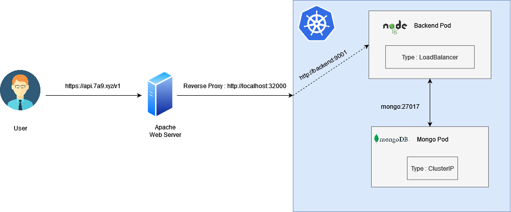

# About This API
### This API was created with the aim of managing users and at the same time I can learn development with kubernetes

# API Architecture

<div style="text-align: center;">



</div>

## Live Demo
```bash
https://api.7a9.xyz/v1
```
## Credentials
### Admin
```bash
username : admin@gmail.com
password : Muis@1234
```
### User
```bash
username : user@gmail.com
password : Danil@1234
```
### Dont forget to import the postman collection 
```bash
Sejutacita_User_Management.postman_collection.json
```


# Deploy with kubernetes
## Make sure you change the environment in kubernetes/01_secrets.yaml
```bash
nano kubernetes/01_secrets.yaml
```
## Deploy
```bash
cd kubernetes
kubectl apply -f .
```


# Test the api
```bash
curl http://[External_URL_Service]/v1
```
### If it works, it should respond with :
```json
{"message":"Welcome to User Management API","created_by":"Muhammad Danil Muis"}
```